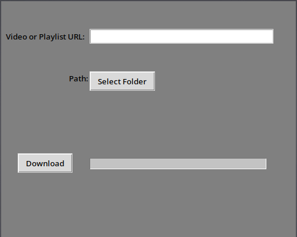
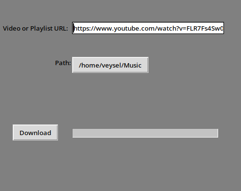
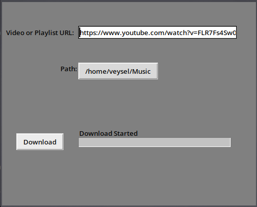
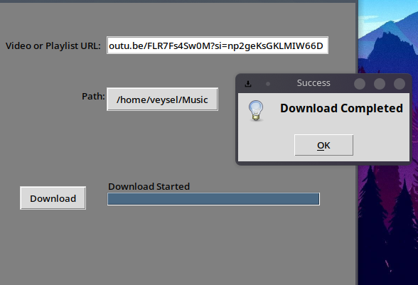

# Youtube-Mp3-Downloader

If you want to install your musics from youtube and do not want to pay for monthly subscriptions use this python script


## Installation

### 1. Install YT-DLP

```bash
    pip install yt-dlp
```    

### 2. Install FFmpeg

#### Windows
Windows 10/11
```powershell
    winget install ffmpeg
```    
#### Linux 
Arch
```bash
    sudo pacman -S ffmpeg
```
Ubuntu/Debian
```bash
    sudo apt install ffmpeg
```    
Fedora
```bash
    sudo dnf install ffmpeg
```

#### Mac
```bash
    brew install ffmpeg
```    


## Screenshots









